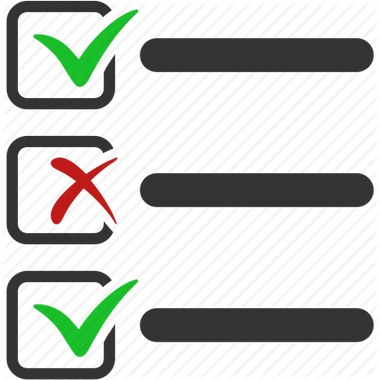
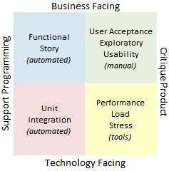
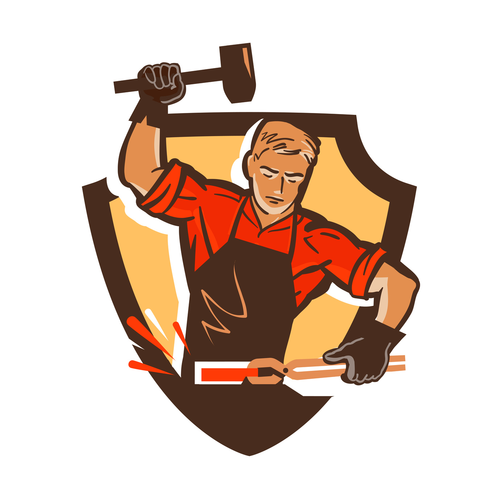

# Software Craftsmanship

---


```rust
fn whoiam() {

    let lastname  = "Moreau";
    let firstname = "David";
    let company   = "Thales Alenia Space";
    let email     = "david.moreau@thalesaleniaspace.com";
    let job       = "Developer/LeadTech/ProductOwner/Craftsman";

}
```

<!--
Pourquoi cette présentation? Livre de Sandro
-->

---
### Agile Manifesto (2001)


<!--
En février 2001, aux États-Unis, dix-sept spécialistes du développement logiciel
* 4 valeurs/12 principes
* mindset + manifest
* framework: scrum/XP...
- Accept change
- Learn to ride
- Feedback loop providing data

Analogie avec le bateau

Meetings became stanup-meetings, backlog, use case - stories
project manager -> scrum master
Scrum, agilité à l'echele, Sage, Less, Scrum of Scrum, Modèle spotify
-->
**Individuals and Interactions** over processes and tools

**Working Software** over comprehensive documentation

**Customer Collaboration** over contract negotiation

**Responding to Change** over following a plan 


---


-->

---


# What's Wrong?


---

#### Wrong understanding

- Well-defined industrial process
- Engineeers and Architects
- Developpers as factory workers
- More developpers, more production
- Monitoring
    - number of lines
    - % comments
<!-- 
A quoi sert un commentaire: le why = git
Commentaires: un commentaire peut devenir faux, non compilable/vérifiable/testable

Un deveppeur sous pression prend des raccourcis, ajoute de la complexité.
Ne prend pas le temps d'automatiser une tache répétitive
-->

---


### What is software development?
<!--
Pourquoi avons-nous oublié cette entropie logicielle?
Mauvaise connaissance du métier de développement logiciel
-->

---


<!--
* Métaphore de la construction, architecte + autres corps de métier
* Archicte construction != Architecte logiciel
* Construction, c'est la compilation. la conception, c'est le développement
* La construction est un procédé industrielle maintenant mature avec des contraintes physiques claires
* Le developpement logiciel reste un métier jeun et surtout en perpetuelle évolution
* La créativité des différents corps de métier reste très limité par rapport au plan
Exemple il y a 30 ans (proc 200Mhz, pas de javascript, ni PHP/java)
* Les progrès de la construction sont simples et visibles alors que le développement logiciel est abstrait et invisible => dmo
* Si on recommence la même maison: temps identique, peu importe les macons
* Différents en softs: apprentissage + différentes compétences

* apprentissage et résolution d'un problème
* Dépendant de l'équipe
-->

---


<!--
* Le développeur écrit du code qui doit être lisible et compris par d'autres
* Certains vont trouver son écriture belle, propore, compréhensible, d'autres non.
* Aspect subjectif de la qualité du code
* L'écrivain utilise un correcteur orhtographique, le développeur utilise sonarQube
-->

---


<!--
* Un logiciel ressemble à un jardin qui mérite un entretien en même temps qu'il grandit
* Entretien régulier/art
* Un logiciel qui n'évolue plus (ou qui ne peut plus), est un logiciel mort
le temps ne peut pas s'arrêter car l'écosystème bouge: les librairies, les systèmes d'exploitation, le hardware, la sécurité.
-->


---


<!-- Définition de l'artisan
Qualification professionnelle pour effectuer un travail manuel
-->

---


###  In a software product, the most important deliverable is the code  itself


---


###  Why better code is so important?
---


## Software Entropy

- **Complexity**
    - Essential
- **Technical Debt**
    - Involuntary
    - Voluntary

<!-- "tendance naturelle d'un système à se désordonner"
Essentielle: lié au métier ou l'architecture
Accidentelle: Multiplication d'interface, dupplication de code
Tech Debt inv: framework qui evolue, version du compilateur
Tech Debt vol: Hack pour répondre à un besoin

Pas de définition objective
Que mesure un outils d'analyse statique


-->

---

<!--
Le seul moyen de ne pas ajouter d'entropie et de ne pas ajouter de ligne de code
Reactory diminue l'entropie ou du moins la ralentie


Changer les cultures et les pratiques
- Boucle from scrach et on recommence

-->

---


---


## Software Crafsmanship Manifesto (2009)
<!--
* 1992, "What Is Software Design?", Jack W. Reeves
* 1999, "The Pragmatic Programmer: From Journeyman to Master "
* 2007, "Software Craftsmanship: The New Imperative"
* 2008, "Craftsmanship over Crap", Robert C. Martin 
* 2009, Manifesto for Software Craftsmanship
* 2010, London Software Craftsmanship Community 
* 2014, "Software Craftsmanship : Professionalism Pragmatism Pride", Sandro Mancuso
* 2017, 2018, 2019 Conférence SC Londres
-->


---


<!--  Oliger de travailler en co-opération pour faire un lociel bien-concu et qui répond au besoin.
Pourquoi: parce des spécifications complètes non anmiugs...
Parce que la notion de forfait ou d'engagement tend à favoriser par nuture l'entropie.
Exemple: bug faute a qui 
-->


---

# Mindset and Behaviors

---
<!-- pour nous et le client -->


- Be responsible & professionnal
- Learn how to say no
- Provide options
- Never stop learning and improving his craft
- Share your knowledges

<!-- -->

<!-- parler d'estimation -->
<!-- On n'a pas le temps -->
<!-- vaincre le syndrome du héros -->
<!-- Trouver des anesdotes -->

<!-- dans l'équipe, dans la société, conférence ... -->
<!-- ici on montre que tous les développeurs sont différents -->


---


# Technical Practices
<!-- jusque quelques pratiques recommandées aujourd'hui -->


---


*Clean code is code that is easy to understand and easy to change.*

<!-- Chaque morceau de code doit exprimer son intention
Pourquoi est-ce important:
* On passe 10 fois plus de temps à lire du code qu'à en écrire
* C'est être responsable de laisser un code propore: 
Pour les autres mais aussi pour nous.

* Simple Desgin (XP)
    * Runs all the tests
    * no duplicate code
    * clearly express intent 
    * YAGNI and KISS principle
* SOLID principles
    * Single responsability
    * Open/Closed
    * Liskov Subsitution
    * Interface Segregation
    * Dependency Inversion
-->
---


# Test Strategy

### Why we test?
- To prove a program is correct? NO
- To find bugs
- To build the software
- To check the software
<!-- Couverture de code à 100% -->

---


<!-- -->


<!-- Test de construction, échafaudage -->
<!-- pas besoin de test , j'ai déjà testé et ca marche -->
<!-- On n'a pas besoin de TU -->
<!-- pas besoin de test, bah non c'est pas le PO qui décide -->
<!-- plus du temps? monter echaffaudage, surtout la première -->
<!-- Boucle de feedback -->


---

<!-- Derisking
Un système qui fonctionne tout le temps
Pas de complexité inutile dans le code 
Fun
-->

---


---
<!-- Une autre pratique technique recommandée par les crafter -->

### Pair/Mob Programming

- Immediate feedback loop
- Better and cleaner code
- Collective ownership
- Share knowledge

--- 


<!--
- Revue de code (// lecture d'un roman)
-->


---


### HOWTO improve our craft?

- Practice Clean Code
- Practice TDD
- Practice Pair/Mob Programing
- Practice...

<!-- 
Coding Dojo, Kata
On ne s'entraine pas sur les projets
Analogie avec un pianiste (concert)
Sinon sur le projet: pas bon
-->


---

### Conclusion


> Professionalism, Pragmatism & Pride


---

### CCSL Software Craftsmanship Community
- [DSP-FR-CCSL-CRAFT](DSP-FR.CCSL-CRAFT@thalesaleniaspace.com)
- [Salon Citadel](https://thales.citadel.team/#/room/!JZljFoeEySYBsjwgrB:thales.citadel.team)
- [Wiki](https://wiki.space.thales/pages/viewpage.action?pageId=405307635)


<!--

>Software Craftsmanship promises to take our industry to the next level, promoting professionalism, technical excellence, the death of the production line and factory workers attitude."
*Sandro Mancuso*

#### Ressources

- Book "Clean Code: A Handbook of Agile Software Craftsmanship", Robert S. Martin, 2008
- Book "Software Craftsmanship : Professionalism Pragmatism Pride", Sandro Mancuso, 2014
- Conference "The Craftsman's Oath", Robert S. Martin - SCLConf 2018 

>Software Craftsmanship is all about putting responsibility, professionalism, pragmatism, and pride back into software developpement.
*Sandro Mancuso, The Software Craftsman, 2014*
-->