# Software Craftsmanship

---


```rust
fn whoiam() {

    let lastname  = "Moreau";
    let firstname = "David";
    let company   = "Thales Alenia Space";
    let email     = "david.moreau@thalesaleniaspace.com";
    let job       = "Developer/LeadTech/ProductOwner/Craftsman";

}
```


---
### Agile Manifesto (2001)


<!--
En février 2001, aux États-Unis, dix-sept spécialistes du développement logiciel
* 4 valeurs/12 principes
* mindset + manifest
* framework: scrum/XP...
-->
**Individuals and Interactions** over processes and tools

**Working Software** over comprehensive documentation

**Customer Collaboration** over contract negotiation

**Responding to Change** over following a plan 


---


###  TL;DR;
* Accept change
* Learn to ride
* Feedback loop providing data
<!--* Business Value Oriented-->


---

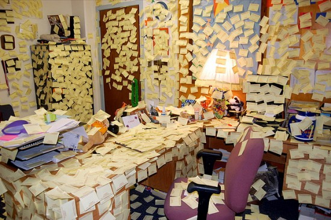
# Agility Everywhere

---


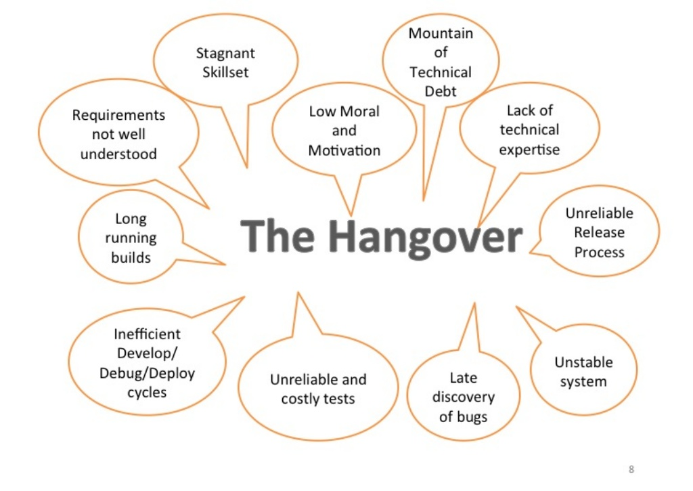
-->

---


# What's Wrong?


---


###  In a software product, the most important deliverable is the code  itself


---


###  Why better code is so important?
---

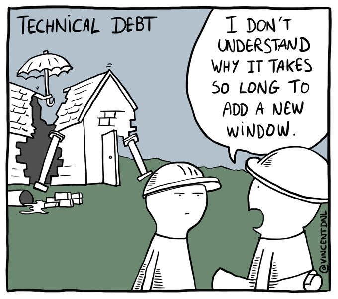

---
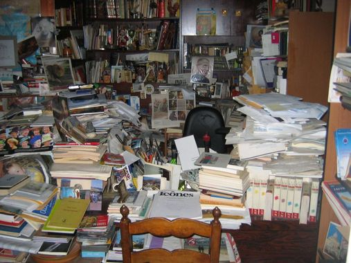
## The Invisible Threat


### Software Entropy
- Complexity
- Technical Debt

<!-- Parallèle avec analyse statique de code
qui calcule une dette technique alors que c'est plutot 
le nombre de faute d'orthograpge !->


<!-- "tendance naturelle d'un système à se désordonner"
* parler de Sonar
Le seul moyen de ne pas ajouter d'entropie et de ne pas ajouter de ligne de code
Complexité accidentelle augmente l'entropie
Refactory diminue l'entropie ou du moins la ralentie
Changer les cultures et les pratiques
-->

---
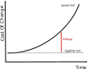

---
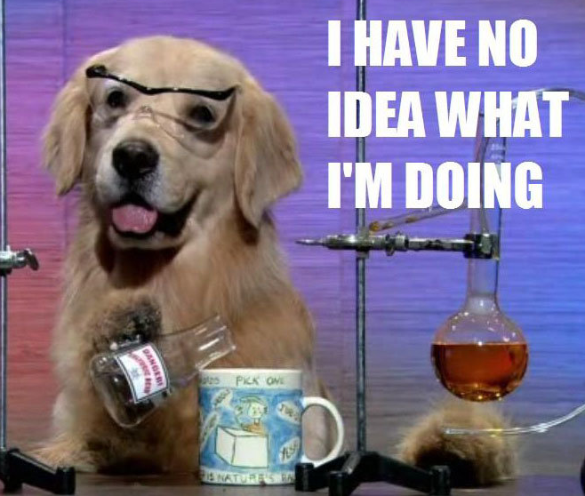

### What is software development?

---

#### Wrong understanding

- Well-defined industrial process
- Engineeers and Architects
- Developpers as factory workers
- More developpers, more production
- Monnitoring
    - number of lines
    - % comments
<!-- Un deveppeur sous pression prend des raccourcis, ajoute de la complexité.
Ne prend pas le temps d'automatiser une tache répétitive -->

---


<!--
* Métaphore de la construction, architecte + autres corps de métier
* Archicte construction != Architecte logiciel
* Construction, c'est la compilation. la conception, c'est le développement
* La construction est un procédé industrielle maintenant mature avec des contraintes physiques claires
* Le developpement logiciel reste un métier jeun et surtout en perpetuelle évolution
* La créativité des différents corps de métier reste très limité par rapport au plan
Exemple il y a 30 ans (proc 200Mhz, pas de javascript, ni PHP/java)
* Les progrès de la construction sont simples et visibles alors que le développement logiciel est abstrait et invisible => dmo
* Si on recommence la même maison: temps identique, peu importe les macons
* Différents en softs: apprentissage + différentes compétences

* apprentissage et résolution d'un problème
* Dépendant de l'équipe
-->

---


<!--
* Le développeur écrit du code qui doit être lisible et compris par d'autres
* Certains vont trouver son écriture belle, propore, compréhensible, d'autres non.
* Aspect subjectif de la qualité du code
* L'écrivain utilise un correcteur orhtographique, le développeur utilise sonarQube
-->

---


<!--
* Un logiciel ressemble à un jardin qui mérite un entretien en même temps qu'il grandit
* Entretien régulier/art
* Un logiciel qui n'évolue plus (ou qui ne peut plus), est un logiciel mort
le temps ne peut pas s'arrêter car l'écosystème bouge: les librairies, les systèmes d'exploitation, le hardware, la sécurité.
-->


---

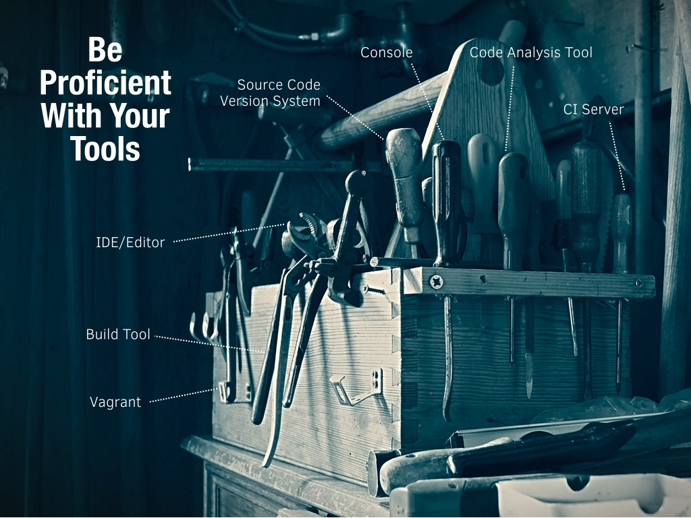
<!-- Définition de l'artisan
Qualification professionnelle pour effectuer un travail manuel
-->


---


## Software Crafsmanship Manifesto (2009)


<!--
* uses **his** knowledge and tools to create a 
specific product to satisfy a client need
* continiously improve its skills, to become a better developper
* Each developper is different
* :arrow_right: Craftsmanship Methaphor
-->

<!-- Pour améliorer vos logiciles, il faut de meilleuirs artisans
Parler de génération de code -->

---


<!-- les sociétés choisissent cherchent uniquement un coût -->

<!--
### HOWTO Create a better Software

- More Software Developpers or better Craftmen?

    - Software Craftsmen
- Give
    - Autonomy
    - Mastering
    - Purpose

---
-->

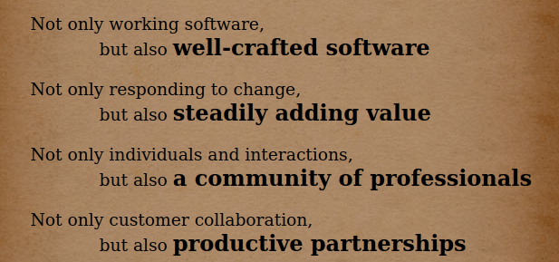


<!-- 
2> Règle du boy-scout
3> 
4> Complexité de comprendre le business
les seules spécificaitons non ambigues sont le code
-->

---
<!--
# Définitions
>Software craftsmanship is an approach to software development that emphasizes the coding skills of the software developers.
>It is a response by software developers to the perceived ills of the mainstream software industry, including the prioritization of financial concerns over developer accountability
*Wikipedia*

## Un peu d'Historique

* 1992, "What Is Software Design?", Jack W. Reeves
* 1999, "The Pragmatic Programmer: From Journeyman to Master "
* 2007, "Software Craftsmanship: The New Imperative"
* 2008, "Craftsmanship over Crap", Robert C. Martin 
* 2009, Manifesto for Software Craftsmanship
* 2010, London Software Craftsmanship Community 
* 2014, "Software Craftsmanship : Professionalism Pragmatism Pride", Sandro Mancuso
* 2017, 2018, 2019 Conférence SC Londres

---
-->

# Mindset and Behaviors

---
<!-- pour nous et le client -->
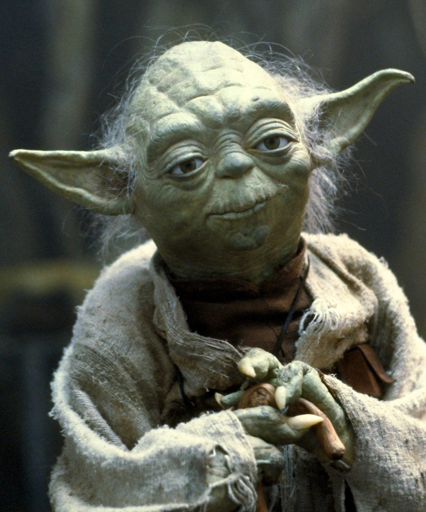

- Be responsible & professionnal
- Learn how to say no
- Provide options
- Never stop learning and improving his craft
- Share your knowledges

<!-- -->

<!-- parler d'estimation -->
<!-- On n'a pas le temps -->
<!-- vaincre le syndrome du héros -->
<!-- Trouver des anesdotes -->

<!-- dans l'équipe, dans la société, conférence ... -->
<!-- ici on montre que tous les développeurs sont différents -->


---


## Technical Practices


---
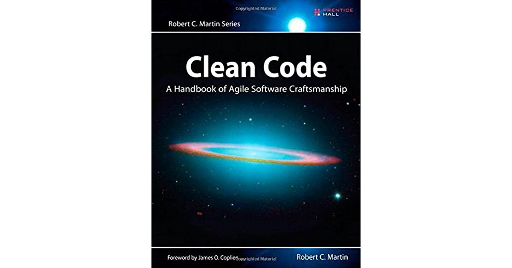

### Clean Code

Clean code is code that is easy to understand and easy to change.

<!-- Chaque morceau de code doit exprimer son intention
Pourquoi est-ce important:
* On passe 10 fois plus de temps à lire du code qu'à en écrire
* C'est être responsable de laisser un code propore: 
Pour les autres mais aussi pour nous.

* Simple Desgin (XP)
    * Runs all the tests
    * no duplicate code
    * clearly express intent 
    * YAGNI and KISS principle
* SOLID principles
    * Single responsability
    * Open/Closed
    * Liskov Subsitution
    * Interface Segregation
    * Dependency Inversion
-->
---
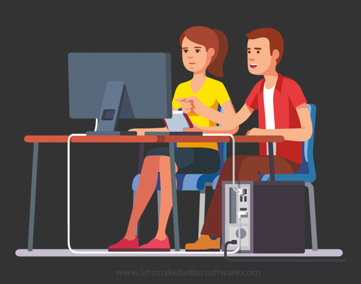
### Pair/Mob Programming

* Immediate feedback loop
* Better and cleaner code
* Collective ownership
* Share knowledge

--- 
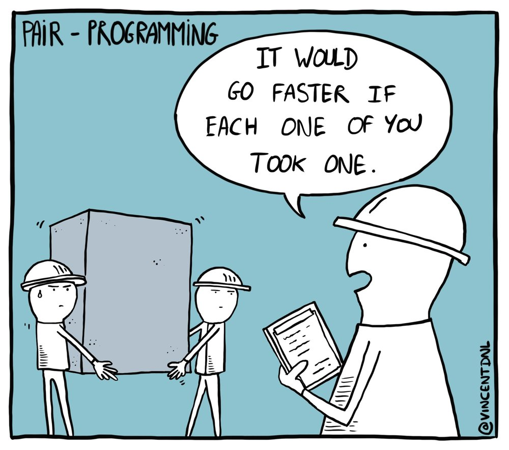

<!--
Parler de collective ownership
-->

---
# Why we Test?
To prove a program is correct
To find bugs
* l'absence de bug
* valider le logiciel?
Non, construction et trouver des bugs
<!-- pas besoin de test, bah non c'est pas le PO qui décide -->
<!-- echaffaudege et harnais de sécurité -->


---
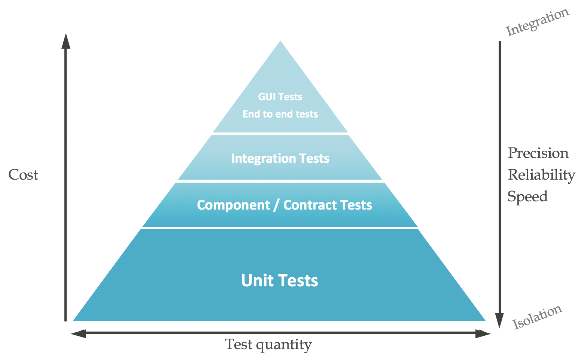
### Test Automation Strategy

<!-- pas besoin de test , j'ai déjà testé et ca marche -->
<!-- On n'a pas besoin de TU -->
<!-- Test de construction, échafaudage -->


---
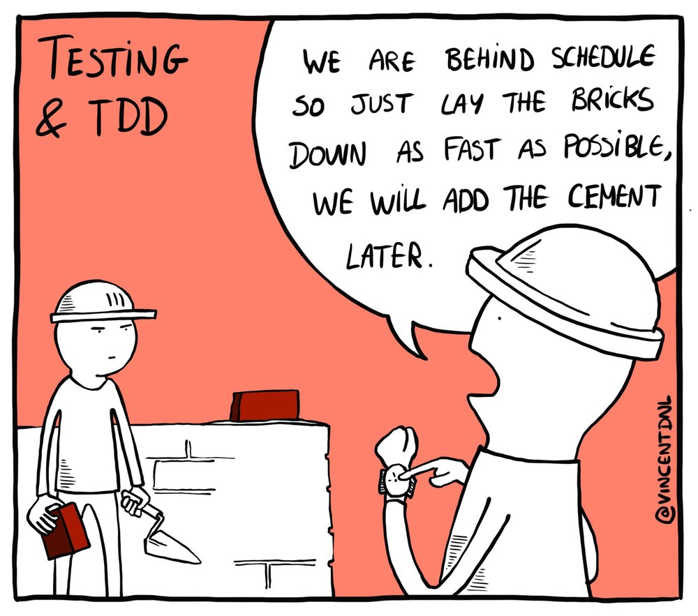

---


---


### HOWTO improve our craft?

* Practice
* Practice
* Practice
* Coding Dojo, Kata...
<!-- 
avec le pianiste
On s'entraine sur les projets =>
pas bon pour le projet
pas bon pour le développeur
-->


---
<style>
img[alt~="center"] {
  display: block;
  margin: 0 auto;
}
</style>

### TL;DR

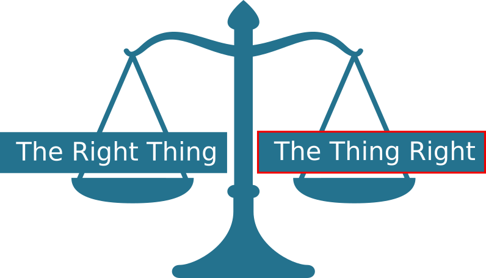


---


>Software Craftsmanship promises to take our industry to the next level, promoting professionalism, technical excellence, the death of the production line and factory workers attitude."
*Sandro Mancuso*

---
#### Ressources

- Book "Clean Code: A Handbook of Agile Software Craftsmanship", Robert S. Martin, 2008
- Book "Software Craftsmanship : Professionalism Pragmatism Pride", Sandro Mancuso, 2014
- Conference "The Craftsman's Oath", Robert S. Martin - SCLConf 2018 

<!--
>Software Craftsmanship is all about putting responsibility, professionalism, pragmatism, and pride back into software developpement.
*Sandro Mancuso, The Software Craftsman, 2014*
-->