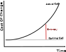

# **Software Craftsmanship**
##  ?

---
# Agile Manifesto (2001)

**Individuals and Interactions** over processes and tools

**Working Software** over comprehensive documentation

**Customer Collaboration** over contract negotiation

**Responding to Change** over following a plan 

---

---

### What's Wrong?
### What's Missing?

 

* In a software product, the most important deliverable is the software itself

---

#### A Naive Approach to Software Projects

- Well-defined industrial process
- Engineeers and Architects
- Developpers as factory workers
- More developpers, more production
- Monnitoring
    - number of lines
    - % comments
<!-- Un deveppeur sous pression prend des raccourcis, ajoute de la complexité.
Ne prend pas le temps d'automatiser une tache répétitive -->

---

#### A Software Developper...
* uses **his** knowledge and tools to create a 
specific product to satisfy a client need
* continiously improve its skills, to become a better developper
* Each developper is different
* :arrow_right: Craftsmanship Methaphor

<!-- Pour améliorer vos logiciles, il faut de meilleuirs artisans
Parler de génération de code -->
<!-- les sociétés choisissent cherchent uniquement un coût -->

---
<!--
### HOWTO Create a better Software

- More Software Developpers or better Craftmen?

    - Software Craftsmen
- Give
    - Autonomy
    - Mastering
    - Purpose

---
-->

### Manifesto (2009)

Not only working software, but also **well-crafted software**

Not only responding to change,but also **steadily adding value**
<!-- Règle du boy-scout -->

Not only individuals and interactions, but also a **community of professionals**

Not only customer collaboration, but also **productive partnerships**

---

#### Software Craftsmanship: A Mindset
<!-->>It's a mindset where software developpers choose to be responsible for their own carreers, constantly bettering themselves.-->

>Software Craftsmanship is all about putting responsibility, professionalism, pragmatism, and pride back into software developpement.
*Sandro Mancuso, The Software Craftsman, 2014*

---
<!--
# Définitions
>Software craftsmanship is an approach to software development that emphasizes the coding skills of the software developers.
>It is a response by software developers to the perceived ills of the mainstream software industry, including the prioritization of financial concerns over developer accountability
*Wikipedia*

---
## Un peu d'Historique

* 1992, "What Is Software Design?", Jack W. Reeves
* 1999, "The Pragmatic Programmer: From Journeyman to Master "
* 2017, "Software Craftsmanship: The New Imperative"
* 2008, "Craftsmanship over Crap", Robert C. Martin 
* 2009, Manifesto for Software Craftsmanship
* 2010, London Software Craftsmanship Community 
* 2014, "Software Craftsmanship : Professionalism Pragmatism Pride", Sandro Mancuso
* 2017, 2018, 2019 Conférence SC Londres

---
-->

# Mindset and Behaviors

- Never stop learning
- Never stop improving his craft
- Learn how to say no
- Provide options
- Be responsible
- Share your knowledges

---

## The Invisible Threat

- Software Entropy
    - Complexity
    - Technical Debt

<!-- "tendance naturelle d'un système à se désordonner" -->

---

### Technical Practices

- Clean Code
    - Keep It Simple, Stupid (KISS)
    - Boy Scout Rule
    - YAGNI
    - Naming, Coupling...
    - Refactoring
- TDD (Test Driven Developpement)
- Pair Programming

---

### TL;DR

---

 
 

>Software Craftsmanship promises to take our industry to the next level, promoting professionalism, technical excellence, the death of the production line and factory workers attitude."
*Sandro Mancuso*

---
#### Ressources

- Book "Clean Code: A Handbook of Agile Software Craftsmanship", Robert S. Martin, 2008
- Book "Software Craftsmanship : Professionalism Pragmatism Pride", Sandro Mancuso, 2014
- Conference "The Craftsman's Oath", Robert S. Martin - SCLConf 2018 
